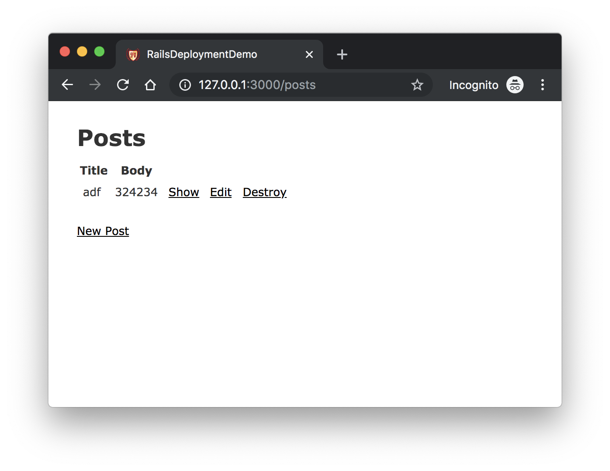

# 简易博客功能

为 Rails app 增加一个简单的博客功能，不至于让应用只有一个 landing page。

## 创建 Posts 脚手架

```
rails generate scaffold post
rails db:migrate
rails server
```

打开浏览器，访问 `http://127.0.0.1:3000/posts`，就可以新建、编辑、删除文章。


