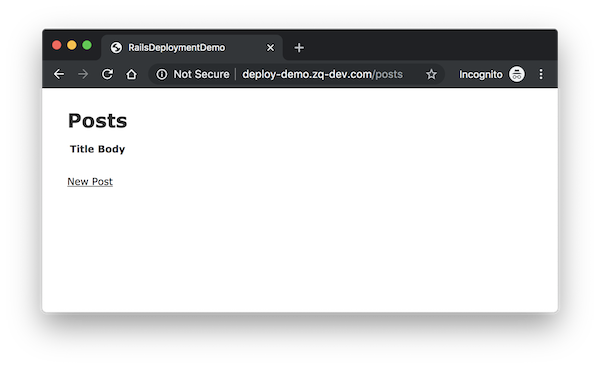
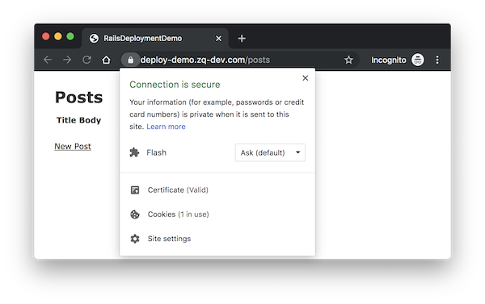
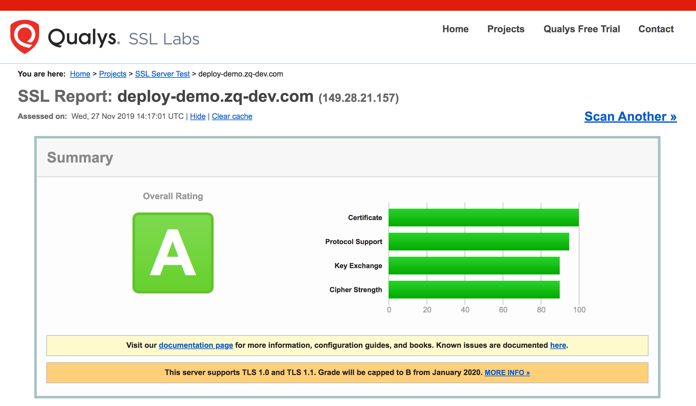

# 配置 HTTPS

参考：[使用 acme.sh 给 Nginx 安装 Let’ s Encrypt 提供的免费 SSL 证书](https://ruby-china.org/topics/31983)

我们使用 [acme.sh](https://github.com/Neilpang/acme.sh) 脚本来配置 SSL。

## 配置 HTTP 访问

登录服务器并执行 `sudo -i` 命令切换到 root 用户。在 `/etc/nginx/sites-enabled/` 目录创建 `deploy-demo.zq-dev.com.conf` 文件并输入以下内容。

```
upstream deploy-demo {
  server unix:///var/www/rails-deployment-demo/current/tmp/sockets/puma.sock fail_timeout=0;
}

server {
  listen 80;
  server_name deploy-demo.zq-dev.com;

  root /var/www/rails-deployment-demo/current/public;
  try_files $uri/index.html $uri @deploy-demo;
  client_max_body_size 1G;
  keepalive_timeout 120;

  location @deploy-demo {
    proxy_pass http://deploy-demo;
    proxy_set_header X-Forwarded-For $proxy_add_x_forwarded_for;
    proxy_set_header Host $host;
    proxy_redirect off;
  }

  location ^~ /assets/ {
    expires max;
    gzip_static on;
    add_header Pragma public;
    add_header Cache-Control public;
  }

  error_page 500 502 503 504 /500.html;
  access_log /var/www/rails-deployment-demo/shared/log/nginx.access.log;
  error_log /var/www/rails-deployment-demo/shared/log/nginx.error.log  error;
}
```

保存文件后执行 `nginx -t` 测试配置文件是否有问题，没问题的话执行 `service nginx relaod` 使配置生效。然后在本地机器的 rails 根目录执行 `rails production deploy`，部署成功后，通过浏览器访问 `http://deploy-demo.zq-dev.com/posts` 就能显示之前做的博客列表页面。



## 使用 acme.sh 签发 TLS 证书

参考 `acme.sh` 的[中文说明](https://github.com/Neilpang/acme.sh/wiki/%E8%AF%B4%E6%98%8E)来安装、配置 [Let’s Encrypt](https://letsencrypt.org/) 提供的证书。使用 root 用户身份来安装 acme.sh，因为后续很多文件需要复制到 nginx 相关的目录里，那些目录默认都是 root 用户权限。

执行以下命令来生成 TLS 证书。

```
# acme.sh --issue -d deploy-demo.zq-dev.com -w /var/www/rails-deployment-demo/current/public/
```

成功申请证书的话会有类似以下的内容输出：

```
[Wed Nov 27 13:17:16 UTC 2019] Create account key ok.
[Wed Nov 27 13:17:16 UTC 2019] Registering account
[Wed Nov 27 13:17:17 UTC 2019] Registered
[Wed Nov 27 13:17:17 UTC 2019] ACCOUNT_THUMBPRINT='qFR...RC4'
[Wed Nov 27 13:17:17 UTC 2019] Creating domain key
[Wed Nov 27 13:17:17 UTC 2019] The domain key is here: /root/.acme.sh/deploy-demo.zq-dev.com/deploy-demo.zq-dev.com.key
[Wed Nov 27 13:17:17 UTC 2019] Single domain='deploy-demo.zq-dev.com'
[Wed Nov 27 13:17:17 UTC 2019] Getting domain auth token for each domain
[Wed Nov 27 13:17:19 UTC 2019] Getting webroot for domain='deploy-demo.zq-dev.com'
[Wed Nov 27 13:17:19 UTC 2019] Verifying: deploy-demo.zq-dev.com
[Wed Nov 27 13:17:22 UTC 2019] Success
[Wed Nov 27 13:17:22 UTC 2019] Verify finished, start to sign.
[Wed Nov 27 13:17:22 UTC 2019] Lets finalize the order, Le_OrderFinalize: https://acme-v02.api.letsencrypt.org/acme/finalize/72646095/1613105727
[Wed Nov 27 13:17:24 UTC 2019] Download cert, Le_LinkCert: https://acme-v02.api.letsencrypt.org/acme/cert/042c335b34ba4968043e247e2b2d31da7718
[Wed Nov 27 13:17:24 UTC 2019] Cert success.
-----BEGIN CERTIFICATE-----
...
-----END CERTIFICATE-----
[Wed Nov 27 13:17:24 UTC 2019] Your cert is in  /root/.acme.sh/deploy-demo.zq-dev.com/deploy-demo.zq-dev.com.cer
[Wed Nov 27 13:17:24 UTC 2019] Your cert key is in  /root/.acme.sh/deploy-demo.zq-dev.com/deploy-demo.zq-dev.com.key
[Wed Nov 27 13:17:24 UTC 2019] The intermediate CA cert is in  /root/.acme.sh/deploy-demo.zq-dev.com/ca.cer
[Wed Nov 27 13:17:24 UTC 2019] And the full chain certs is there:  /root/.acme.sh/deploy-demo.zq-dev.com/fullchain.cer
```

安装证书。

```
# acme.sh --installcert -d deploy-demo.zq-dev.com \
          --keypath       /var/www/rails-deployment-demo/ssl/deploy-demo.zq-dev.com.key  \
          --fullchainpath /var/www/rails-deployment-demo/ssl/deploy-demo.zq-dev.com.pem \
          --reloadcmd     "service nginx force-reload"
```

成功的话会输出

```
[Wed Nov 27 13:54:18 UTC 2019] Installing key to:/var/www/rails-deployment-demo/ssl/deploy-demo.zq-dev.com.key
[Wed Nov 27 13:54:18 UTC 2019] Installing full chain to:/var/www/rails-deployment-demo/ssl/deploy-demo.zq-dev.com.pem
[Wed Nov 27 13:54:18 UTC 2019] Run reload cmd: service nginx force-reload
[Wed Nov 27 13:54:18 UTC 2019] Reload success
```

cd 进入 `/var/www/rails-deployment-demo/ssl/` 目录并执行 `openssl dhparam -out dhparam.pem 4096` 命令，这个命令执行时间会比较长，可能需要 15 ~ 20 分钟。

然后再次编辑 `/etc/nginx/sites-enabled/deploy-demo.zq-dev.com.conf` 文件，修改为以下内容。

```
upstream deploy-demo {
  server unix:///var/www/rails-deployment-demo/current/tmp/sockets/puma.sock fail_timeout=0;
}

server {
  listen 80;
  server_name deploy-demo.zq-dev.com;
  return 301 https://$host$request_uri;
}

server {
  listen 443 ssl;
  server_name deploy-demo.zq-dev.com;

  ssl on;
  ssl_certificate     /var/www/rails-deployment-demo/ssl/deploy-demo.zq-dev.com.pem;
  ssl_certificate_key /var/www/rails-deployment-demo/ssl/deploy-demo.zq-dev.com.key;
  ssl_session_timeout 30m;
  ssl_protocols TLSv1 TLSv1.1 TLSv1.2;
  ssl_prefer_server_ciphers on;
  ssl_ciphers EECDH+ECDSA+AESGCM:EECDH+aRSA+AESGCM:EECDH+ECDSA+SHA512:EECDH+ECDSA+SHA384:EECDH+ECDSA+SHA256:ECDH+AESGCM:ECDH+AES256:DH+AESGCM:DH+AES256:RSA+AESGCM:!aNULL:!eNULL:!LOW:!RC4:!3DES:!MD5:!EXP:!PSK:!SRP:!DSS;
  ssl_dhparam /var/www/rails-deployment-demo/ssl/dhparam.pem;
  ssl_session_cache shared:le_nginx_SSL:1m;

  root /var/www/rails-deployment-demo/current/public;
  try_files $uri/index.html $uri @deploy-demo;
  client_max_body_size 1G;
  keepalive_timeout 120;

  location @deploy-demo {
    proxy_pass http://deploy-demo;
    proxy_set_header X-Forwarded-For $proxy_add_x_forwarded_for;
    proxy_set_header X-Forwarded-Proto $scheme;
    proxy_set_header X-Forwarded-Ssl on;
    proxy_set_header X-Forwarded-Port $server_port;
    proxy_set_header X-Forwarded-Host $host;
    proxy_set_header Connection "Upgrade";
    proxy_set_header Upgrade $http_upgrade;
    proxy_set_header Host $host;
    proxy_redirect off;
  }

  location ^~ /assets/ {
    expires max;
    gzip_static on;
    add_header Pragma public;
    add_header Cache-Control public;
  }

  error_page 500 502 503 504 /500.html;
  access_log /var/www/rails-deployment-demo/shared/log/nginx.access.log;
  error_log /var/www/rails-deployment-demo/shared/log/nginx.error.log  error;
}
```

保存后再次执行 `nginx -t` 检查配置是否有问题，没问题的话执行 `service nginx restart` 重启 NGINX。

再次到浏览器刷新页面，即可强制 HTTPS 访问了。



也可以访问 [https://www.ssllabs.com/ssltest/](https://www.ssllabs.com/ssltest/) 输入域名进行检查。



### 检查证书更新

因为 Let's Encrypt 的证书有效期只有 90 天，所以我们需要配置定时任务在证书过期更新证书。这部分配置 acme.sh 已经帮你做了的。执行 `crontab -l` 查看定时任务，正常会输出以下内容。

```
58 0 * * * "/root/.acme.sh"/acme.sh --cron --home "/root/.acme.sh" > /dev/null
```

执行 `acme.sh --cron --home "/root/.acme.sh" --force` 强制更新以确保证书更新有效。

到此我们就从零开始配置好了一个 rails web 项目的 HTTPS 上线。
