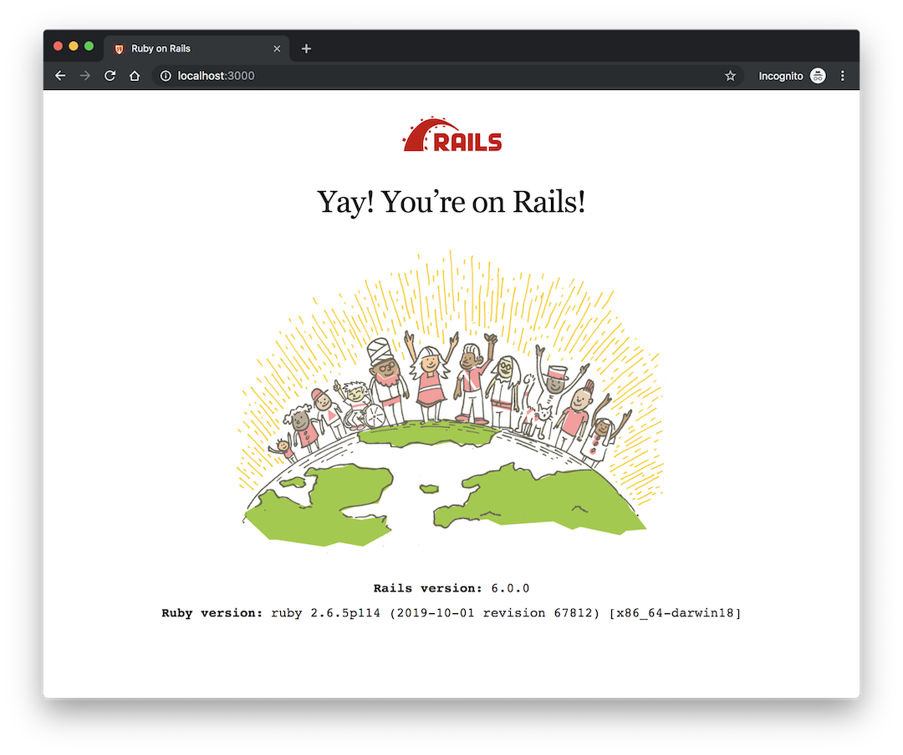

# Create Rails App

要部署 Rails 应用，第一步就是先创建它。本文会创建一个用于演示的 Rails demo app。

## 步骤

### 确认本地环境

截至本文写作的当前时间（2019年10月份），最新的 Ruby 版本是 [2.6.5](https://www.ruby-lang.org/en/news/2019/10/01/ruby-2-6-5-released/)。而 Rails 的最新版本是 [6.0.0](https://weblog.rubyonrails.org/2019/8/15/Rails-6-0-final-release/)。

```
$ ruby -v
# => ruby 2.6.5p114 (2019-10-01 revision 67812) [x86_64-darwin18]
$ gem install rails -v 6.0.0
$ rails -v
# => Rails 6.0.0
$ gem install bundler
$ bundler -v
# => Bundler version 2.0.2
$ postgres -V
# => postgres (PostgreSQL) 11.3
```

### `rails new`

确认开发环境的依赖都安装好后，可以执行 `rails new` 命令来创建应用。

```
$ rails new rails-deployment-demo -d postgresql
$ cd rails-deployment-demo
$ rails db:create db:migrate
# => Created database 'rails_deployment_demo_development'
# => Created database 'rails_deployment_demo_test'
$ rails server
```

此时打开浏览器并输入 `http://localhost:3000/`，能访问到以下页面，则说明创建 Rails 应用成功。



初始化成功后，我们进行第一次 git commit 提交。

```
$ git add .
$ git commit -m 'Init project'
```

此时你需要在 GitHub 创建一个仓库，并根据 GitHub 的操作提示，把代码推上到仓库里。然后再在 GitHub 上把你本地的 ssh public key 添加到 GitHub。

我把 demo repo 放到了 GitHub 上 [rails-deployment-demo](https://github.com/zhaqiang/rails-deployment-demo)

后续的部署脚本提交记录也会同步到该仓库。
