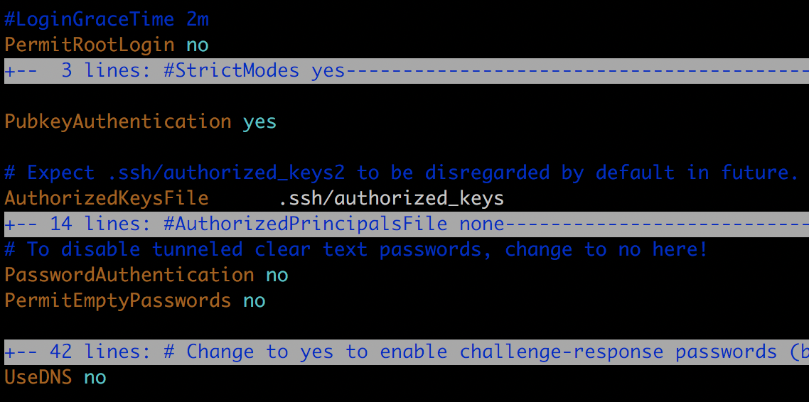

# Initialize VPS

部署 rails app 前，需要购买并初始化 VPS。

## 购买 VPS

到[阿里云](https://promotion.aliyun.com/ntms/yunparter/invite.html?userCode=3tfq70ed)（使用我的推广链接注册我可以获得一些优惠券和返利）或者其他 VPS 服务器提供商（例如 [Vultr.com](https://www.vultr.com/?ref=7367765)）注册账号，并购买 VPS。

配置至少 1 CPU 2 GB 内存，不然部署的时候编译静态资源可能不够内存而导致部署失败。操作系统选 Ubuntu 18.04 64位。

## 创建部署用户

### 1. 首次登录服务器

创建好 VPS 后，服务器提供商的网页界面会提供初始的服务器 IP、登录用户名和密码。

```
$ ssh username@your-server-ip
```

### 2. 创建部署用户

假设我们用于部署 rails app 的新用户名是 `deploy`。（后续会把这个 `deploy` 用户写到 [Capistrano](https://github.com/capistrano/capistrano) 的部署脚本里。）

```
$ sudo adduser deploy
```


根据提示输入密码等信息。然后在命令行输入 `sudo visudo` 为 deploy 用户设置 sudo 权限。`visudo` 命令会打开 `/etc/sudoers` 文件，找到下方那一行内容。

```
root    ALL=(ALL:ALL) ALL
```

在其后新增一行配置，先按 `CTRL+O`，然后按 `CRTL+X` 保存文件并退出编辑。

```
root    ALL=(ALL:ALL) ALL
deploy  ALL=(ALL) NOPASSWD:ALL
```

这里编辑 `/etc/sudoers` 文件一定得通过 `sudo visudo` 命令来进行。因为文件的开头有一个温馨提示：

```
$ sudo head -n 3 /etc/sudoers
#
# This file MUST be edited with the 'visudo' command as root.
#
```

如果你通过其他编辑器来修改 `/etc/sudoers` 文件并且出错了，那就没办法修正错误了，因为你再也没权限编辑这个文件。

然后新开一个 terminal 窗口，执行下面的命令确保新用户可以登录。

```
$ ssh deploy@your-server-ip
```

### 3. 设置无密码 ssh 登录

首先确保本地电脑有 ssh public key `~/.ssh/id_rsa.pub`，没有的话参考 [Generating a new SSH key and adding it to the ssh-agent](https://help.github.com/en/github/authenticating-to-github/generating-a-new-ssh-key-and-adding-it-to-the-ssh-agent) 创建一个。在本地生成 ssh public key 后执行下面命令将其添加到服务器的 `/home/deploy/.ssh/authorized_keys` 文件。

```
$ cat ~/.ssh/id_rsa.pub | ssh deploy@your-server-ip "mkdir -p ~/.ssh && cat - >> ~/.ssh/authorized_keys"
```

此时会要求输入步骤 2 创建 deploy 用户时设置的密码。成功后再次 `ssh deploy@your-server-ip` 登录服务器就不用再输入密码了。

### 4. 配置 sshd

登录服务器，编辑 `/etc/ssh/sshd_config` 文件，禁止 root 用户登录和用密码方式登录，增加 ssh 登录的安全性。查看文件，对照着修改以下配置项。

```
PermitRootLogin no

PubkeyAuthentication yes

AuthorizedKeysFile .ssh/authorized_keys

PasswordAuthentication no
PermitEmptyPasswords no

UseDNS no
```



最后在文件末尾增加以下内容，允许 deploy 用户登录。

```
AllowUsers deploy
```

保存后执行以下命令修改 `authorized_keys` 文件权限。

```
$ chmod 600 ~/.ssh/authorized_keys && chmod 700 ~/.ssh/
```

重启 sshd。

```
$ sudo service ssh restart
```

**注意**：这时候先不要在当前 terminal 退出服务器的登录，需要新开一个 terminal 窗口再次登录服务器，能成功登录则表示修改没问题。不能登录的话就是配置有误，需要在上一个已登录的 terminal 将配置修改正确后，才能退出服务器登录。不然就没办法再次登录服务器了。

### 5. 配置 OS 环境

执行 `locale` 命令检查服务器区域设置。如果不是 `en_US.UTF-8`，就执行下面命令修改。

```
$ sudo locale-gen en_US en_US.UTF-8
$ sudo dpkg-reconfigure locales
```

最后更新 OS 的软件。

```
sudo apt-get update
sudo apt-get -y upgrade
```
### 6. Bonus

虽然经过上述步骤后，`ssh deploy@your-server-ip` 可以登录服务器了，但是 IP 地址确实是不好记忆。可以编辑本地的 `~/.ssh/config` 文件，加入以下内容，就可以用 `ssh deploy-demo` 来登录服务器了。

```
Host deploy-demo
HostName your-server-ip
User deploy
```
