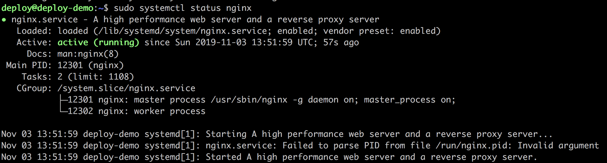
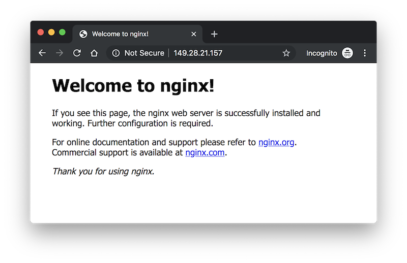

# Setup Server

初始化服务器之后、部署 Rails 应用前，需要安装相应的依赖软件。

## Git

```
$ sudo apt install git
$ git --version
# => git version 2.17.1
```

## Node.js

```
$ sudo apt install nodejs
$ node -v
# => v8.10.0
```

## RVM

参考：[ubuntu_rvm](https://github.com/rvm/ubuntu_rvm)

```
$ sudo apt-get install software-properties-common -y
$ sudo apt-add-repository -y ppa:rael-gc/rvm
$ sudo apt-get update
$ sudo apt-get install rvm -y
# 退出服务器并重新登录，以使 login shell 加载 rvm 环境
$ rvm -v
# => rvm 1.29.9 (manual) by Michal Papis, Piotr Kuczynski, Wayne E. Seguin [https://rvm.io]
```

运行 `rvm list known` 查看可安装的 Ruby 版本，如果没有你想安装的新版本的话，执行 `rvmsudo rvm get master` 更新可安装版本列表。

此时可能会提示你 "gpg: Can't check signature: No public key" 的错误，根据指引执行以下命令，成功后再执行 `rvmsudo rvm get master` 即可。

```
$ sudo gpg --keyserver hkp://pool.sks-keyservers.net --recv-keys 409B6B1796C275462A1703113804BB82D39DC0E3 7D2BAF1CF37B13E2069D6956105BD0E739499BDB
```

安装了新的 rvm，需执行 `rvm reload` 加载新版本。此时 `rvm list known` 就能找到我们要安装的 `ruby-2.6.5` 版本。然后就可以执行以下安装 Ruby 的命令。

```
$ rvmsudo rvm install 2.6.5
$ rvm --default use 2.6.5
$ ruby -v
#=> ruby 2.6.5p114 (2019-10-01 revision 67812) [x86_64-linux]
```

## NGINX

参考：[Install and Configure Nginx on Ubuntu Linux 18.04 LTS](https://www.cyberciti.biz/faq/install-and-configure-nginx-on-ubuntu-linux-18-04-lts/)

安装并查看状态。Ubuntu 18.04 LTS 安装好 NGINX 就会启动它并且设置开机自启动。

```
$ sudo apt install nginx
$ sudo systemctl status nginx
```



然后打开浏览器输入 `http://your-server-ip`，确保 NGINX 正常工作。



## PostgreSQL

参考：[Linux downloads (Ubuntu)](https://www.postgresql.org/download/linux/ubuntu/)

添加 PostgreSQL 的 apt 仓库并安装。

```
$ sudo sh -c 'echo "deb http://apt.postgresql.org/pub/repos/apt/ `lsb_release -cs`-pgdg main" >> /etc/apt/sources.list.d/pgdg.list'
$ wget --quiet -O - https://www.postgresql.org/media/keys/ACCC4CF8.asc | sudo apt-key add -
$ sudo apt-get update
$ sudo apt-get install postgresql postgresql-contrib -y
```

安装成功后，系统会创建多一个名为 `postgres` 的系统用户，并且创建名为 `postgres` 的数据库用户。执行以下命令检查 pg 是否正常。

```
$ sudo su - postgres
$ psql
```

登录 pg 数据库后，查看登录状态。

```
postgres-# \conninfo
# => You are connected to database "postgres" as user "postgres" via socket in "/var/run/postgresql" at port "5432".
postgres-# \q
```
